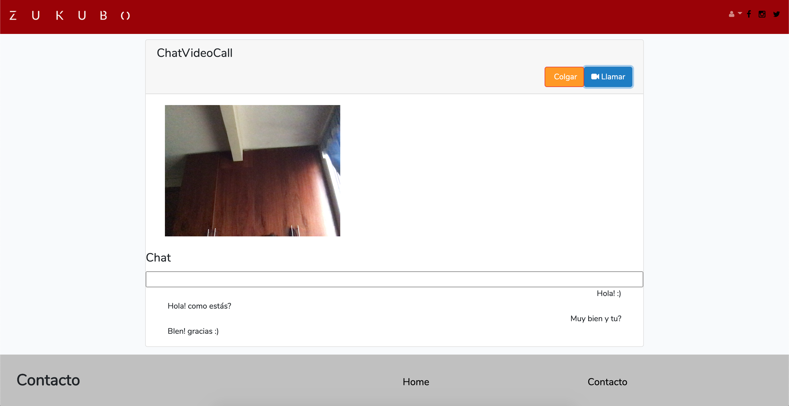
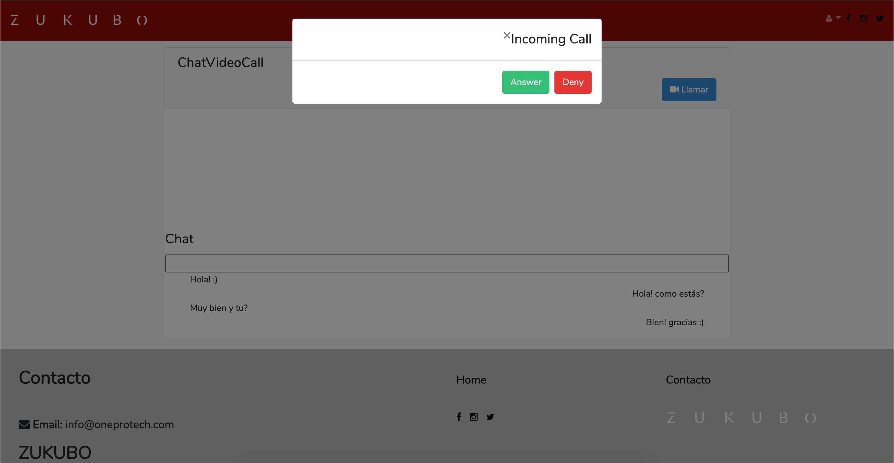
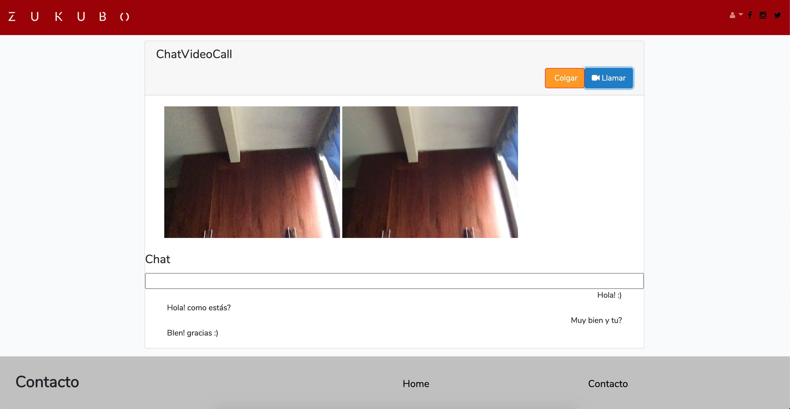
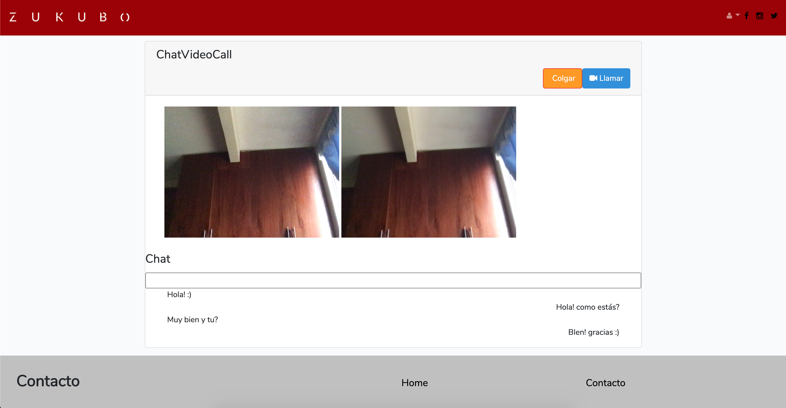

# ChatVideoCallLaravel

 

Chat and Video Call using Laravel 7.0, Redis y Laravel Echo Server

 
Demo de chat en tiempo real y video llamada

 
 

# Pasos
1. Clonar el repositorio
2. cp .env.exmaple .env
3. composer install
4. npm install
5. php artisan migrate
6. php artisan db:seed --class=DataSeeder

# Chat and VideoCall
1. Iniciar Redis: redis-server /usr/local/etc/redis.conf
2. Iniciar Laravel Echo Server: npx laravel-echo-server start
3. Iniciar Servidor en Laravel: php artisan serve
4. Por defecto el proyecto funcionará en la siguiente ruta: http://127.0.0.1:8000

# Cuentas generadas para pruebas
user1@gmail.com 123456
user2@gmail.com 123456

 

Para video llamada desde diferentes redes usar servidores TURN y STUNT

# Demo
http://chatvideocall.oneprotech.com

 

 
 
 
 
